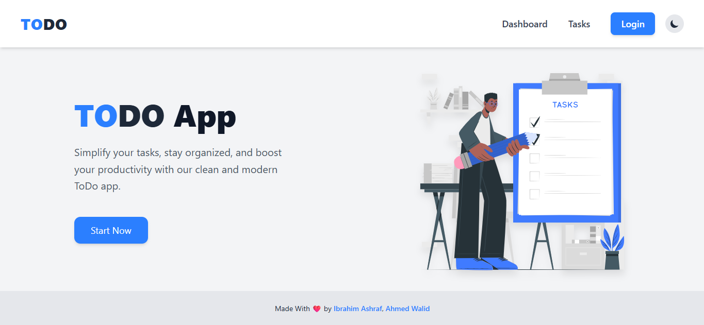
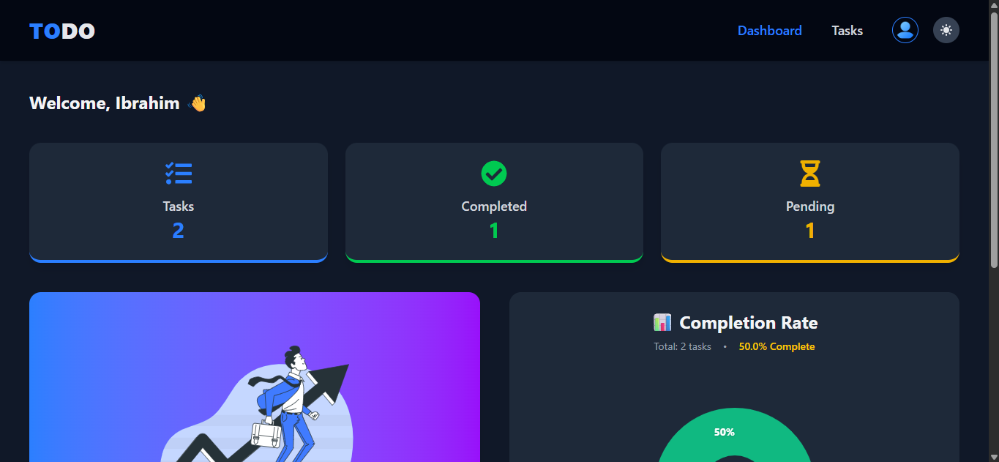
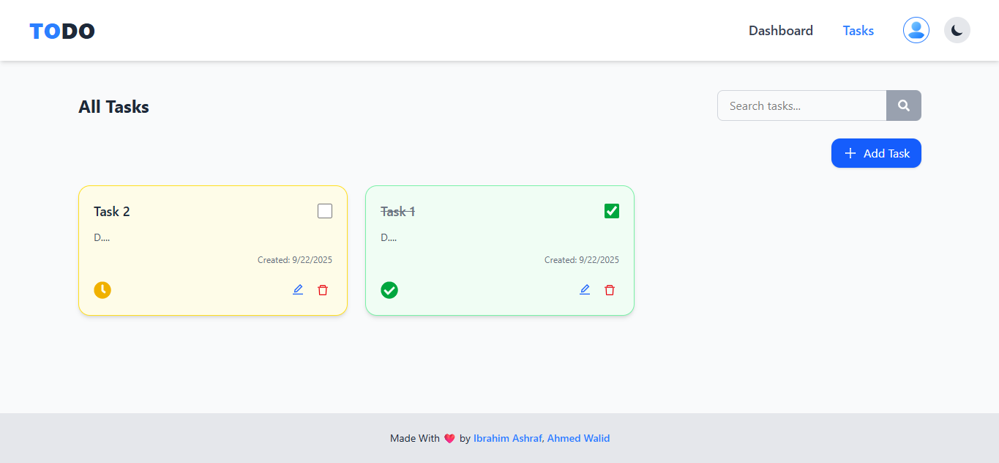

# Advanced To-Do App

[](https://github.com/Ibrahim-Ashraf-Saber/advanced-to-do/commits/main)
[](https://github.com/Ibrahim-Ashraf-Saber/advanced-to-do)
[](https://github.com/Ibrahim-Ashraf-Saber/advanced-to-do)
[](https://github.com/Ibrahim-Ashraf-Saber/advanced-to-do)

A modern and advanced To-Do application built with **React**, **Vite**, and **Tailwind CSS**. Organize your tasks, track your productivity, and enjoy a seamless user experience with authentication, persistent login, and beautiful charts.

---

## 🚀 Features

- 📝 Add, edit, complete, and delete tasks
- 🔍 Real-time search with instant results
- 📊 Dashboard with progress and completion charts
- 🔒 User authentication (Sign up, Login, Logout, Persistent Login)
- 🌙 Dark mode support
- 🛎️ Toast notifications and confirmation dialogs
- ⚡ Fast development with Vite and HMR
- 📱 Responsive and accessible UI
- 🎨 Styled with Tailwind CSS & Headless UI

---

## 🌐 Demo

[Live Demo](https://advanced-to-do-blond.vercel.app/)

---

## 🖼️ Screenshots

<p align="center">
  
</p>
<p align="center">
  
</p>
<p align="center">
  
</p>

---

## 🛠️ Tech Stack

- [React](https://react.dev/)
- [Vite](https://vitejs.dev/)
- [Tailwind CSS](https://tailwindcss.com/)
- [React Router](https://reactrouter.com/)
- [Recharts](https://recharts.org/)
- [React Toastify](https://fkhadra.github.io/react-toastify/)
- [SweetAlert2](https://sweetalert2.github.io/)
- [Headless UI](https://headlessui.com/)

---

## 🏁 Getting Started

### Prerequisites

- Node.js (v18 or higher recommended)
- npm

### Installation

1. **Clone the repository:**

   ```sh
   git clone https://github.com/Ibrahim-Ashraf-Saber/advanced-to-do.git
   cd advanced-to-do

   npm install
   ```

2. **Folder Structure:**

   Your project folder should look like this:

   ```
   src/
     assets/         # Images and SVGs
     components/     # Reusable UI components
     contexts/       # React context providers
     hooks/          # Custom React hooks
     pages/          # Page components (routes)
     utils/          # Utility functions
     App.jsx         # Main app component
     main.jsx        # App entry point
   ```

3. **Run the development server:**

   ```sh
   npm run dev
   ```

4. **Build for production:**

   ```sh
   npm run build
   ```

5. **Run tests:**

   ```sh
   npm test
   ```

---

Made with ❤️ by [Ibrahim Ashraf](https://github.com/Ibrahim-Ashraf-Saber)
